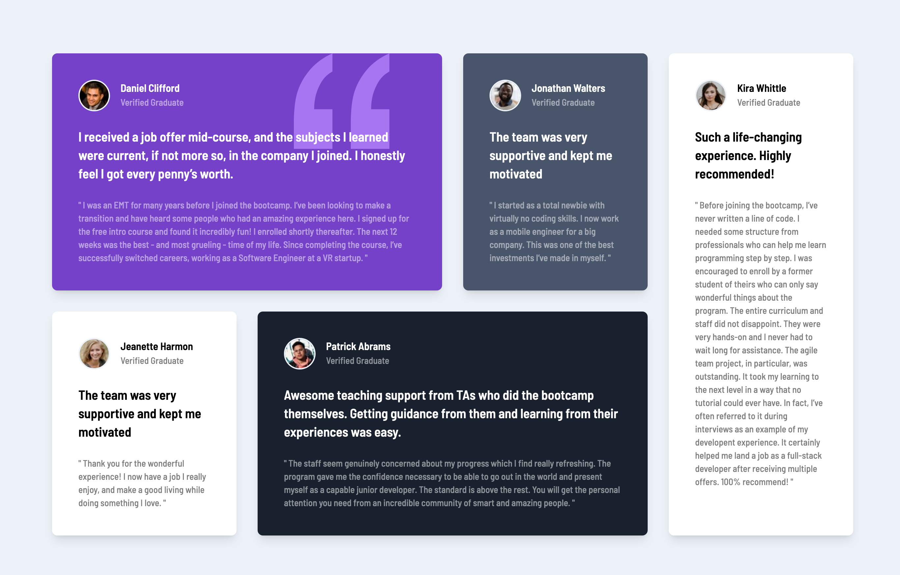
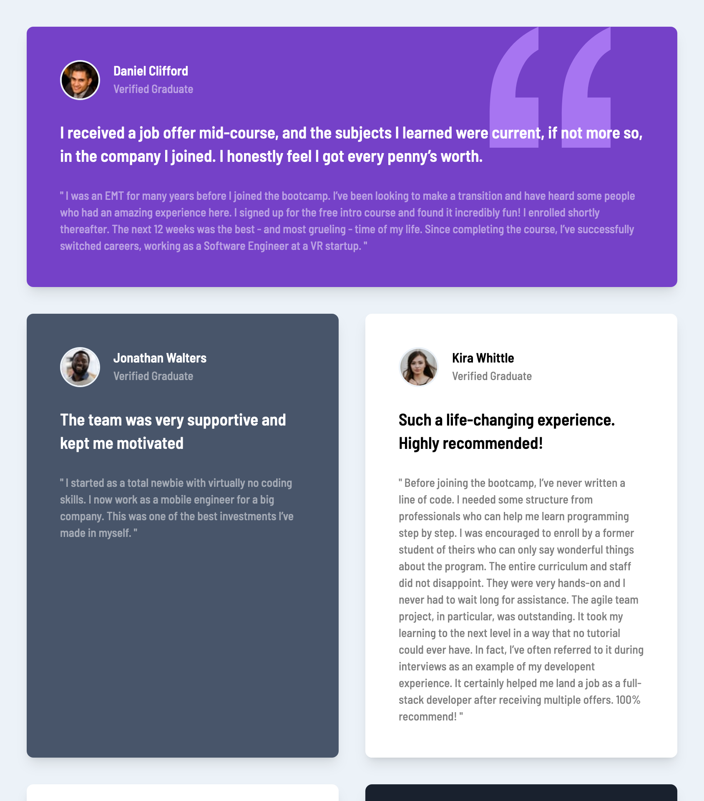

# Frontend Mentor - Testimonials grid section solution

This is a solution to the [Testimonials grid section challenge on Frontend Mentor](https://www.frontendmentor.io/challenges/testimonials-grid-section-Nnw6J7Un7). Frontend Mentor challenges help you improve your coding skills by building realistic projects.

## Table of contents

- [Overview](#overview)
  - [The challenge](#the-challenge)
  - [Screenshot](#screenshot)
  - [Links](#links)
- [My process](#my-process)
  - [Built with](#built-with)
  - [Useful resources](#useful-resources)
- [Author](#author)
- [Acknowledgments](#acknowledgments)

## Overview

### The challenge

Users should be able to:

- View the optimal layout for the site depending on their device's screen size

### Screenshot

### Links

- Solution URL: [Here](https://github.com/tomtrin/fe_testimonials_grid_component)
- Live Site URL: [Here](https://tomtrin.github.io/fe_testimonials_grid_component/)

## My process

### Built with

- Test Driven Development
- Semantic HTML5 markup
- TailwindCSS
- Typescript
- [React](https://reactjs.org/) - JS library
- [Vite](https://vitejs.dev/) - Blazing-fast tool for project scaffolding and bundling

### Useful resources

- [template-configs](https://github.com/tomtrin/template-configs) - Project I created to help install tailwind & unit testing dependencies / config files to my Vite + Typescript based React projects.

## Author

- Github - [tomtrin](https://github.com/tomtrin)
- Frontend Mentor - [@tomtrin](https://www.frontendmentor.io/profile/tomtrin)

